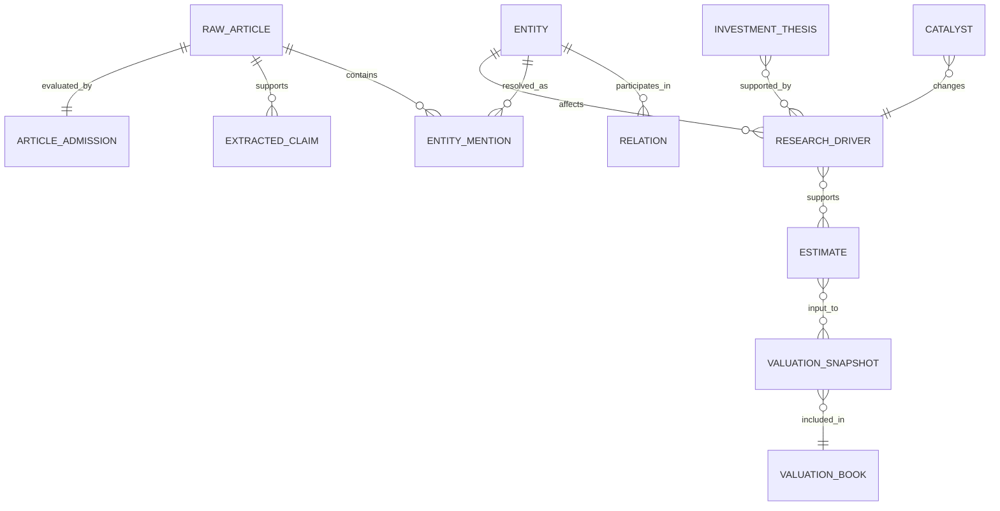

# AXIOM v0.4 Logical Data Model

```mermaid
erDiagram
  ENTITY ||--o{ RELATION : participates_in
  ENTITY ||--o{ ENTITY_MENTION : resolved_as
  RAW_ARTICLE ||--o{ ENTITY_MENTION : contains
  RAW_ARTICLE ||--o{ EXTRACTED_CLAIM : supports
  RAW_ARTICLE ||--|| ARTICLE_ADMISSION : evaluated_by
  ENTITY ||--o{ RESEARCH_DRIVER : affects
  CATALYST }o--|| RESEARCH_DRIVER : changes
  INVESTMENT_THESIS }o--o{ RESEARCH_DRIVER : supported_by
  RESEARCH_DRIVER }o--o{ ESTIMATE : supports
  ESTIMATE }o--o{ VALUATION_SNAPSHOT : input_to
  VALUATION_SNAPSHOT }o--|| VALUATION_BOOK : included_in
```
